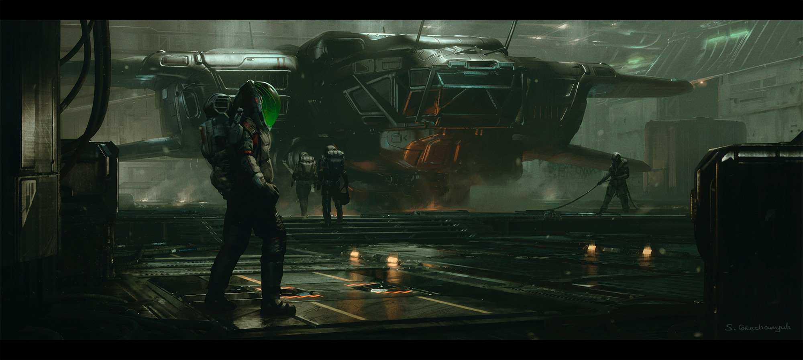
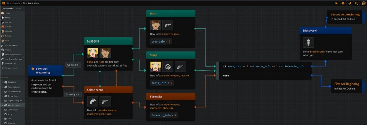
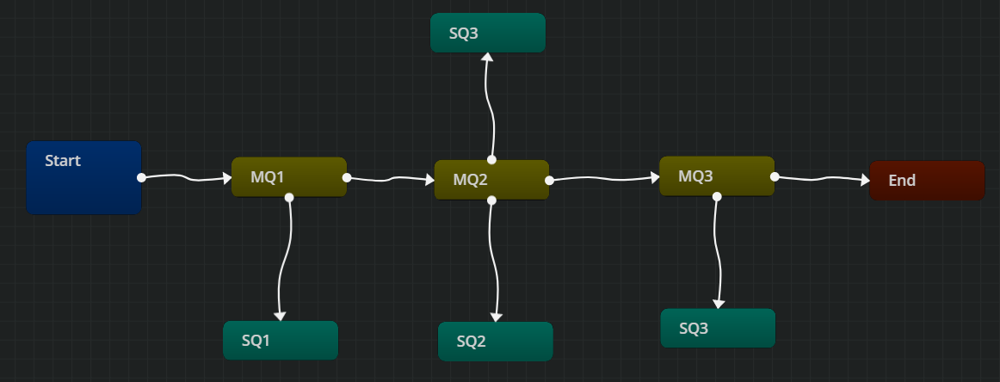
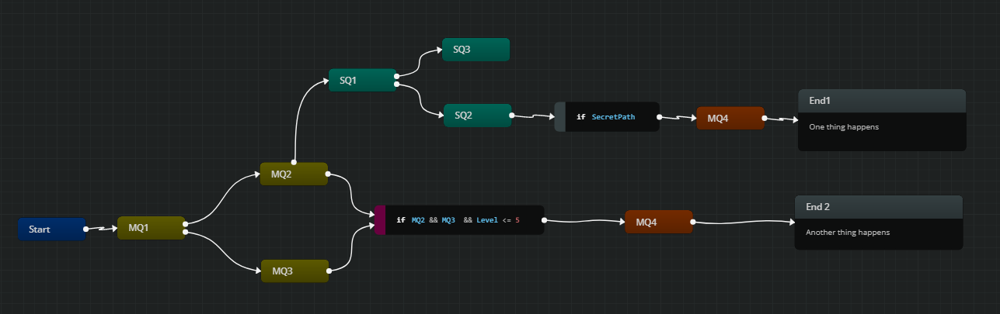
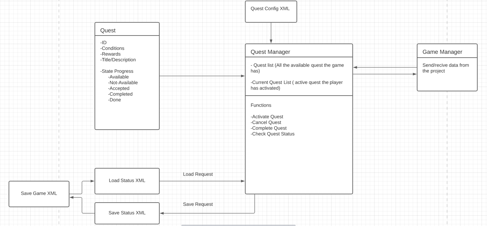

A quest manager or quest system is a part of the video game development where you control the storyline and the progression of the chracter
in your game. It can get very simple or very complex, that is why you want to know how the story and the progression of your game very clear,
so the design process of the system gets simplified and avoid overcomplicated system design.





## Writing

Before start writing, the best aproach is to set what are the main parts the storyline, then add some related secondary quests to have a 
general feeling of the game storyline.

Stories must be crafted in such a way as to seamlessly integrate different medium forms. If done right, viewers forget they’re reading text, 
listening to sound effects, looking at visuals and scrolling down all at the same time and begin to experience it as a whole.
Each form contributes a different and new piece of information and ties in naturally with the rest of elements.



## Progression

The quests order and connections will define how the game progresses and evolves. 
There are diferent aproaches to develope the progression of an interactive story.


### Lineal Progression

For lineal progression stories the quests are consecutive and dont have a complex code to handle events and keep track of the progress.
Is very straight forward, one quest after another, even having secondary quest available on each point of the story, not infuencing the main progress. 



### Dynamic Progression

Dynamic storylines are a way to make the user expirience a story from many points of views depending on their actions and choices, increasing replayability.
This type of progrssion requieres a highly defined design since it can get very complex and extensive.
This means that for example you could have two different endings depending on the actions in previous quest or just by finding hiden path in the storyline.
Also imposing many requisits to acces certain quest in the story.



# Design

At this point we should have decided what type of progression our game will have, leading to design our quest system.

A system basically consist in to parts, the data structure and the behaivior. The data structure is how we organize all the elements
how many elements we will have. The behaivior is how we manage this data structure and how they comunicate between them and with the rest of the project.



##  Data Structure Design

To structure our data we have to define well each component of the system and their functionality.

In this case we will have an ID, a description of the quest and the title, some conditions to complete the quest, prerequisites to havea avilable the quest and a reward.
Also we will have a state to keep track of te quest progress.

```
int ID;

String title, description;

bool* conditions;

bool* prerequisites;

State{
	AVAILABLE,
	NOT_AVAILABLE,
	ACTIVE,
	COMPLETE,
	DONE
};
```

## Behavioral Design

This means to design how the system will do things on the program internaly and externaly, how will it comunicate with other systems and how will manage all the items.


